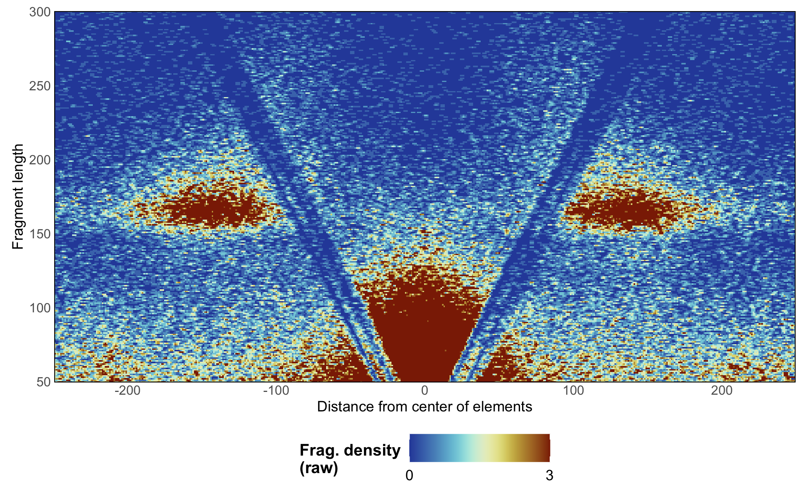
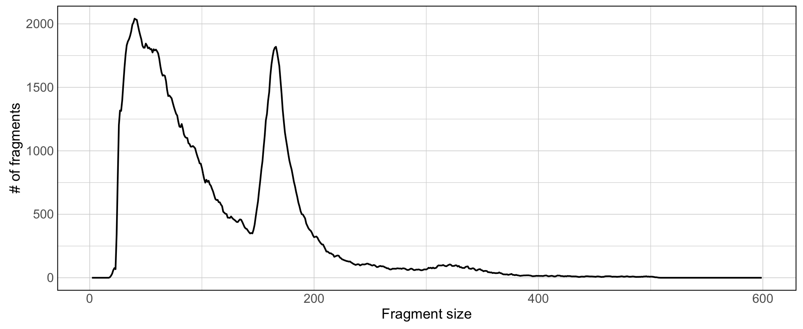

[](https://www.bioconductor.org/packages/VplotR)
[](https://travis-ci.com/js2264/VplotR)
[](https://codecov.io/github/js2264/VplotR?branch=master)
[](https://www.tidyverse.org/lifecycle/#maturing)
[](https://github.com/js2264/VplotR)
[](https://www.gnu.org/licenses/gpl-3.0.en.html)

# VplotR 

## Introduction

This R package makes the process of generating fragment density plots 
(also known as "V-plots") straightforward. V-plots have been introduced 
[for the first time](https://www.ncbi.nlm.nih.gov/pmc/articles/PMC3215028/) 
by the Henikoff lab in 2011. Recently, V-plots have proven to be very 
instructive to understand the molecular organization of the chromatin. 
For instance, the 
[nucleoATAC](https://genome.cshlp.org/content/early/2015/08/27/gr.192294.115)
package relies on cross-correlation of ATAC-seq fragment density plots to 
accurately map nucleosome occupancy along the genome.  
VplotR aim is to streamline the process of generating V-plots. It contains 
wrapping functions to import paired-end sequencing bam files and generate 
V-plots around genomic loci of interest.  
VplotR is designed around [ggplot2](https://ggplot2.tidyverse.org/) and 
makes full use of its potential. As such, it is easy to generate V-plots 
in batches and combine them with other plots to make 
publication-ready figures.  

## V-plots: what they are and how to interpret them

V-plots are two-dimensional plots of paired-end sequencing fragments from 
chromatin accessibility assays (e.g. ATAC-seq, MNase-seq or DNAse-seq) of 
from chromatin immunoprecipitation assays (i.e. ChIP-seq).  

The x axis represents the distance between sequencing fragments and genomic 
loci of interest (e.g. nucleosome-depleted regions, or NDR), while the y axis 
indicates the length of the sequenced fragments. The color scale indicates 
the density of fragments mapping over aggregated genomic loci of interest.  


Thus, V-plots can reveal where protein bound to DNA (e.g. nucleosomes) 
protect it from digestion. 

## System requirements 

VplotR has been tested on Mac OS (`>= 10.13`), Ubuntu (`>= 18.04`) and Windows Server (`2012`).  
VplotR requires `R >= 4.0` and is available from Bioconductor (release `> 3.12`). 

## Installation

VplotR and all its dependencies can be installed from Bioconductor:

```r
if (!requireNamespace("BiocManager", quietly = TRUE))
    install.packages("BiocManager")
BiocManager::install("VplotR")
library("VplotR")
```

VplotR developpment version can be installed from Github as follows:

```r
install.packages("devtools")
devtools::install_github("js2264/VplotR")
```

## Main functions 

The main user-level functions of VplotR are `getFragmentsDistribution()`, 
`plotVmat()`, `plotFootprint()` and `plotProfile()`.

* `getFragmentsDistribution()` computes the distribution of fragment sizes
  over sets of genomic ranges;
* `plotVmat()` is used to compute fragment density and generate V-plots;
* `plotFootprint()` generates the MNase-seq or ATAC-seq footprint at a 
  set of genomic ranges.
* `plotProfile()` is used to plot the distribution of paired-end fragments 
  at a single locus of interest.

See the [package vignette](https://jserizay.com/VplotR/articles/VplotR.html) 
for an in-depth introduction to the package functionalities and 
the [reference](https://jserizay.com/VplotR/reference/index.html) 
for a full description of each function, a list of the available data 
provided in the package and examples of use cases.

## Get started with VplotR 

### Plotting a V-plot

V-plots can be generated using the `plotVmat()` function: 

```r
data(MNase_sacCer3_Henikoff2011)
data(ABF1_sacCer3)
p <- plotVmat(
    x = MNase_sacCer3_Henikoff2011, 
    granges = ABF1_sacCer3
)
```



### Importing sequencing fragments are `GRanges`

Paired-end `.bam` files are imported using the `importPEBamFiles()` 
function as follows:

```r
library(VplotR)
bamfile <- system.file("extdata", "ex1.bam", package = "Rsamtools")
fragments <- importPEBamFiles(
    bamfile,
    shift_ATAC_fragments = TRUE
)
fragments
```

```r
##   GRanges object with 1572 ranges and 0 metadata columns:
##            seqnames    ranges strand
##               <Rle> <IRanges>  <Rle>
##        [1]     seq1    41-215      +
##        [2]     seq1    54-255      +
##        [3]     seq1    56-258      +
##        [4]     seq1    65-255      +
##        [5]     seq1    65-265      +
##        ...      ...       ...    ...
##     [1568]     seq2 1326-1542      -
##     [1569]     seq2 1336-1544      -
##     [1570]     seq2 1358-1550      -
##     [1571]     seq2 1380-1557      -
##     [1572]     seq2 1353-1562      -
##     -------
##     seqinfo: 2 sequences from an unspecified genome; no seqlengths
```

### Plotting fragment size distribution 

The distribution of fragment sizes can be computed with 
the `getFragmentsDistribution()` function: 

```r
library(VplotR)
data(MNase_sacCer3_Henikoff2011)
data(ABF1_sacCer3)
df <- getFragmentsDistribution(
    MNase_sacCer3_Henikoff2011,
    ABF1_sacCer3
)
ggplot(df, aes(x = x, y = y)) + 
    geom_line() + 
    theme_ggplot2() + 
    labs(x = "Fragment size", y = "# of fragments")
```



### Datasets provided in VplotR

Several dataset samples are provided as `GRanges` 
object in this package:

- A set of tissue-specific ATAC-seq experiments in
young adult _C. elegans_ (Serizay et al., 2020):

```r
library(VplotR)
data(ATAC_ce11_Serizay2020)
ATAC_ce11_Serizay2020
```

```r
##   $Germline
##   GRanges object with 462371 ranges and 0 metadata columns:
##              seqnames            ranges strand
##                 <Rle>         <IRanges>  <Rle>
##          [1]     chrI           426-514      +
##          [2]     chrI         3588-3854      +
##          [3]     chrI         3640-3798      +
##          [4]     chrI         3650-3694      +
##          [5]     chrI         3732-3863      +
##          ...      ...               ...    ...
##     [462367]     chrX 17712277-17712469      -
##     [462368]     chrX 17712279-17712342      -
##     [462369]     chrX 17712282-17712565      -
##     [462370]     chrX 17712285-17712384      -
##     [462371]     chrX 17712287-17712576      -
##     -------
##     seqinfo: 7 sequences from an unspecified genome; no seqlengths
##   
##   $Neurons
##   GRanges object with 367935 ranges and 0 metadata columns:
##              seqnames            ranges strand
##                 <Rle>         <IRanges>  <Rle>
##          [1]     chrI         4011-4241      +
##          [2]     chrI         7397-7614      +
##          [3]     chrI       11279-11502      +
##          [4]     chrI       12744-12819      +
##          [5]     chrI       14381-14433      +
##          ...      ...               ...    ...
##     [367931]     chrX 17687948-17687982      -
##     [367932]     chrX 17699614-17699853      -
##     [367933]     chrX 17706798-17706923      -
##     [367934]     chrX 17708264-17708347      -
##     [367935]     chrX 17709920-17710007      -
##     -------
##     seqinfo: 7 sequences from an unspecified genome; no seqlengths
```

- An MNase-seq experiment in yeast (Henikoff et al., 2011) 
and associated ABF1 binding sites:

```r
library(VplotR)
data(MNase_sacCer3_Henikoff2011)
```

```r
##   GRanges object with 400000 ranges and 0 metadata columns:
##              seqnames        ranges strand
##                 <Rle>     <IRanges>  <Rle>
##          [1]     chrI         2-116      +
##          [2]     chrI         14-66      +
##          [3]     chrI        15-134      +
##          [4]     chrI        54-167      +
##          [5]     chrI        66-104      +
##          ...      ...           ...    ...
##     [399996]   chrXVI 920439-920471      -
##     [399997]   chrXVI 920439-920486      -
##     [399998]   chrXVI 920439-920528      -
##     [399999]   chrXVI 920442-920659      -
##     [400000]   chrXVI 920454-920683      -
##     -------
##     seqinfo: 17 sequences from an unspecified genome
```

- A `.bam` file sample containing 100,000 reads mapped to _C. elegans_:

```r
library(VplotR)
data(bam_test)
```

```r
##   GRanges object with 100000 ranges and 0 metadata columns:
##              seqnames        ranges strand
##                 <Rle>     <IRanges>  <Rle>
##          [1]     chrI       425-554      +
##          [2]     chrI       426-555      +
##          [3]     chrI       459-604      +
##          [4]     chrI       459-604      +
##          [5]     chrI       504-634      +
##          ...      ...           ...    ...
##      [99996]     chrI 355817-355907      -
##      [99997]     chrI 355863-356018      +
##      [99998]     chrI 355864-355975      +
##      [99999]     chrI 355880-355917      +
##     [100000]     chrI 355883-355988      +
##     -------
##     seqinfo: 7 sequences from an unspecified genome; no seqlengths
```

For a full list of the data available in this package, please go to the 
[reference page](https://jserizay.com/VplotR/reference/index.html#section-data). 

## Contributions

Code contributions, bug reports, fixes and feature requests are most welcome.
Please make any pull requests against the master branch at 
https://github.com/js2264/VplotR
and file issues at https://github.com/js2264/VplotR/issues.  
Feel free to reach out to [J. Serizay](mailto:jacquesserizay@gmail.com) for any 
query. 

## License 

**VplotR** is licensed under the GPL-3 license.

## Code of Conduct

Please note that `VplotR` is released with a 
[Contributor Code of Conduct](https://contributor-covenant.org/version/2/0/CODE_OF_CONDUCT.html).  
By contributing to this project, you agree to abide by its terms.
