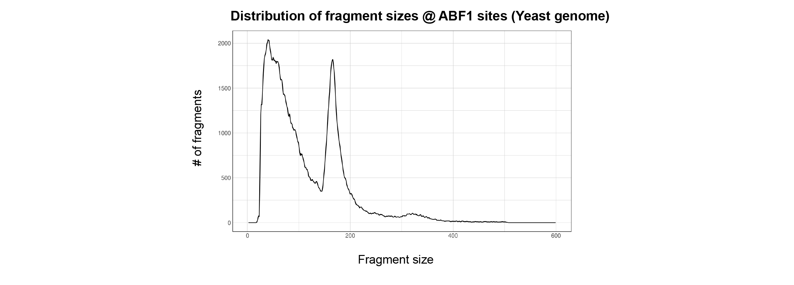
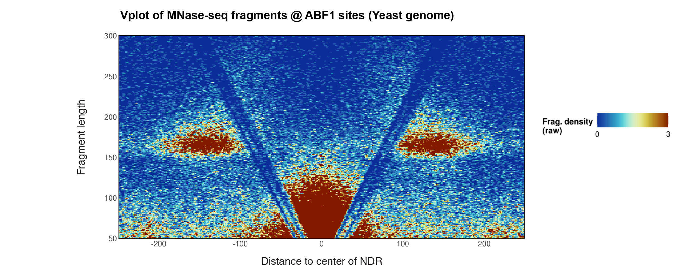
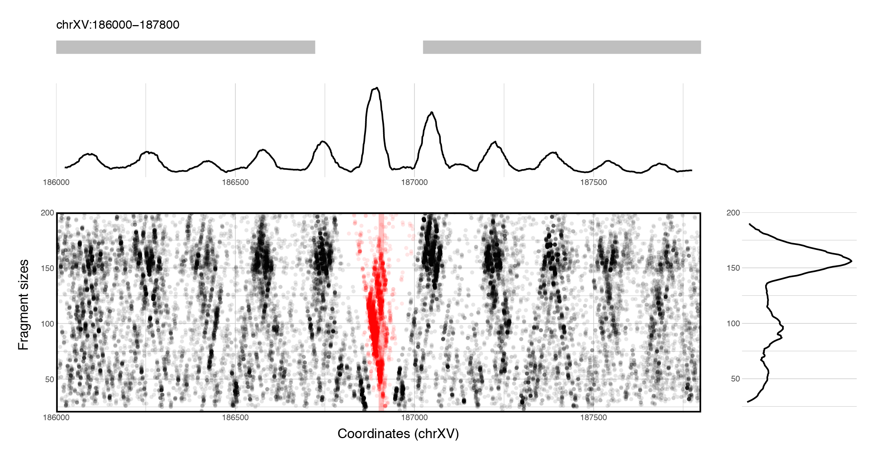

# Summary

A multitude of proteins bind to DNA at regulatory regions to control the expression of neighbouring genes. Their binding can be revealed by chromatin accessibility assays such as DNase-seq, MNase-seq or ATAC-seq. The size of the sequencing fragments generated by these assays, as well as their location relative to the center of regulatory regions, can be used to produce two-dimensional fragment density plots called V-plots. Such plots have successfully been used in the past to reveal nucleosome positioning or transcription factor binding sites at regulatory regions in different genomes.  

Here, we present VplotR, an R package to easily generate V-plots and one-dimensional footprint profiles over single or aggregated genomic loci of interest. The use of VplotR will improve our understanding of molecular organization at regulatory regions.

# Statement of Need

VplotR is an R package facilitating the generation of V-plots, i.e. two-dimensional paired-end sequencing fragment density plots [@Henikoff2011Nov]. V-plots have been used in the past to elucidate nucleosome positioning and/or transcription factor binding at regulatory elements [@Henikoff2011Nov; @Schep2015Aug] (e.g. \autoref{fig:example}).  

VplotR provides functions to import paired-end sequencing bam files from any type of DNA accessibility experiments (e.g. ATAC-seq, DNA-seq, MNase-seq) and can produce V-plots and one-dimensional footprint profiles over single or aggregated genomic loci of interest. The R package is well integrated within the Bioconductor environment and easily fits in standard genomic analysis workflows. Integrating V-plots into existing analytical frameworks has already brought new insights in chromatin organization [@Serizay2020Oct].  

![Interpretation of V-plots. A- Sequenced fragments (for instance obtained from ATAC-seq) mapping to a locus of interest can originate from either nucleosomal DNA (in pink) or from nucleosome-free DNA (for instance from nucleosome-depleted regions (NDRs), in blue). B- The fragments can be embedded in a two-dimension graph. The horizontal coordinate represents the distance from the center of a fragment to the center of a locus of interest (for instance the NDR). The vertical coordinate represents the length of the fragment. C- When this projection is done over hundreds of loci, it results in a fragment density plot, i.e. a matrix which can be visualized as a heatmap, with the color gradient representing the density of fragments at each set of coordinates.\label{fig:example}](figures/figures_example.png)

# Availability 

VplotR is available as an R package and can be readily installed from Bioconductor. The development version can be found on GitHub. Package dependencies and system requirements are documented at https://js2264.github.io/VplotR/. VplotR has been tested using R (version 3.5 and later) on macOS (versions 10.11 and later), Ubuntu 18.04.2 and Windows machines.  

To ensure stability, VplotR includes unit tests for most functions and supports continuous integration using the Travis CI platform. Code contributions, bug reports, fixes and feature requests are most welcome by opening issues and pull requests at https://js2264.github.io/VplotR/.  

# Implementation

The main user-level functions of VplotR are `plotVmat()`, `plotProfile()` and `plotFootprint()`. `plotVmat()` is used to generate V-plots (i.e. paired-end fragment density plots aggregated over a set of loci of interest) while `plotProfile()` is used to generate paired-end fragment plots over a single genomic locus. `plotFootprint()` can be used to profile the DNA accessibility footprint measured by a genomic assay over a motif of interest. Additional functions such as `importPEBamFiles()` and `getFragmentsDistribution()` are useful to import and investigate sets of paired-end sequencing fragments. Full examples of how to use the main package functions are described in the package vignette available at https://js2264.github.io/VplotR/articles/VplotR.html.

# Workflow

## Installation 

VplotR and all its dependencies can be installed from Bioconductor: 

```r
if (!requireNamespace("BiocManager", quietly = TRUE))
    install.packages("BiocManager")
BiocManager::install("VplotR")
library("VplotR")
```

## Importing data into R environment

Importing paired-end sequencing fragments (usually from MNase-seq, DNase-seq or ATAC-seq experiments) can be done with VplotR using the `importPEBamFiles()` function. If imported fragments were obtained by ATAC-seq, the argument `shift_ATAC_fragments` should be set to `TRUE` to shift the ATAC-seq sequencing fragments by +4/-5 bp [@Buenrostro2013Oct; @Adey2010Dec]. 

```r
### To import paired-end fragments (e.g. ATAC-seq fragments), 
### use `importPEBamFiles()`:
fragments <- importPEBamFiles(
    'path/to/fragments/ATACseq-fragments.bam', 
    shift_ATAC_fragments = TRUE
)

### Toy datasets are provided as examples for this study: 
data(ABF1_sacCer3)
data(MNase_sacCer3_Henikoff2011)
```

## Checking fragment size distribution

The distribution of fragment sizes can be obtained with `getFragmentsDistribution()` and plotted using `ggplot2` (\autoref{fig:fragsize}):

```r
### The one-dimensional distribution of fragment 
### sizes is obtained using the 
### getFragmentsDistribution() function:
dist <- getFragmentsDistribution(
    MNase_sacCer3_Henikoff2011, 
    ABF1_sacCer3
)

### The resulting data frame can be plotted 
### with ggplot2 (see Figure 2)
ggplot(dist, aes(x = x, y = y)) +
    geom_line() +
    theme_ggplot2() +
    labs(
        title = 'Distribution of fragment sizes', 
        x = 'Fragment size', y = '# of fragments'
    )
)
```



## Plotting fragment density over a set of genomic loci

`plotVmat()` is used to produce a V-plot (\autoref{fig:vplot}):

```r
plotVmat(
    MNase_sacCer3_Henikoff2011, 
    ABF1_sacCer3
)
```



Several Vplots can also be produced at once using a list of parameters as 
input (see https://js2264.github.io/VplotR/articles/VplotR.html#multiple-vplots 
for more information).

## Plotting DNA accessibility footprint

Observations from V-plots can be further investigated by plotting DNA accessibility footprints over these loci. The `plotFootprint()` function can be leveraged to plot these footprint profiles (\autoref{fig:footprint}). 

```r
plotFootprint(
    MNase_sacCer3_Henikoff2011,
    ABF1_sacCer3
)
```


## Plotting fragments over a single genomic locus

Finally, VplotR provides a function to plot the distribution of paired-end fragments over an individual genomic window (\autoref{fig:locus}). 

```r
genes_sacCer3 <- GenomicFeatures::genes(
    TxDb.Scerevisiae.UCSC.sacCer3.sgdGene::
    TxDb.Scerevisiae.UCSC.sacCer3.sgdGene
)
plotProfile(
    fragments = MNase_sacCer3_Henikoff2011,
    window = "chrXV:186,400-187,400", 
    loci = ABF1_sacCer3, 
    annots = genes_sacCer3,
    min = 20, max = 200, alpha = 0.1, size = 1.5
)
```



The paired-end fragments overlapping a locus of interest (e.g., binding sites, provided in the `loci` argument) are shown in red while the remaining fragments mapping to the genomic window are displayed in black. Marginal curves are also plotted on the side of the distribution plot; they highlight the smoothed distribution of the position of paired-end fragment midpoints (top) or of the paired-end fragment length (right). Furthermore, genomic features provided in the `annots` arguments are displayed as horizontal bars on top of the plots. Here, the distribution of yeast MNase paired-end fragments over the bi-directional promoter regulating two divergent genes clearly reveals the ABF1 binding site (in red) located in the nucleosome-depleted region (NDR). 

# Research using VplotR

VplotR was recently leveraged to provide accurate insights into differential organization of nucleosomes flanking ubiquitous or tissue-specific promoters in *C. elegans* [@Serizay2020Oct]. 

# Data availability

Yeast MNase-seq data has been obtained from @Henikoff2011Nov (SRR3193263). ABF1 and REB1 binding motifs in yeast have been annotated in sacCer3 genome using `TFBStools` [@Tan2016May] and `JASPAR2018` [@Khan2018Jan]. The motif occurrences with a relScore >= 0.90 were considered to be real binding sites. 

# References

